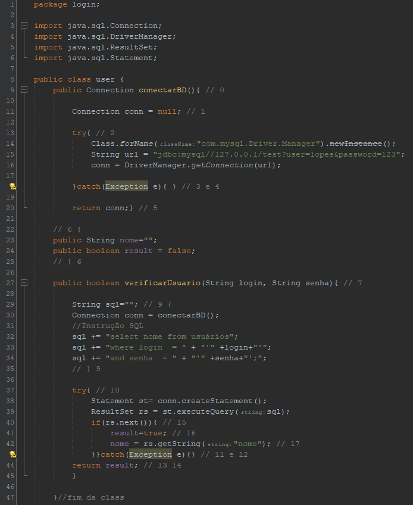
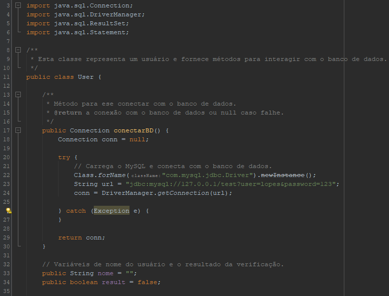
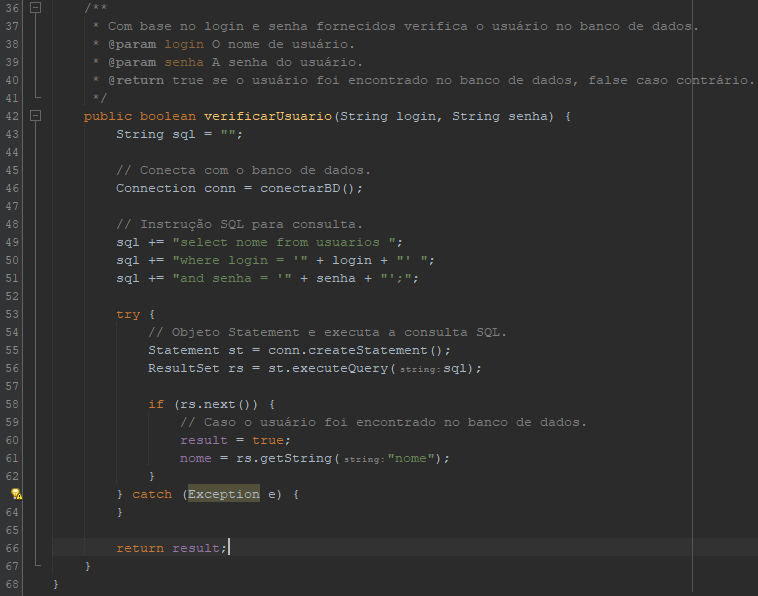

# Teste de Caixa Branca - Qualidade e Testes de Software

## Descrição
O objetivo do teste é documentar um código em Java, utilizando métodos e práticas aprendidas na disciplina

### Desenvolvimento

### Documentação 

##### Publicação
https://github.com/santn11/CaixaBranca.git

###### Ultima Modificação: 17/10/2023

